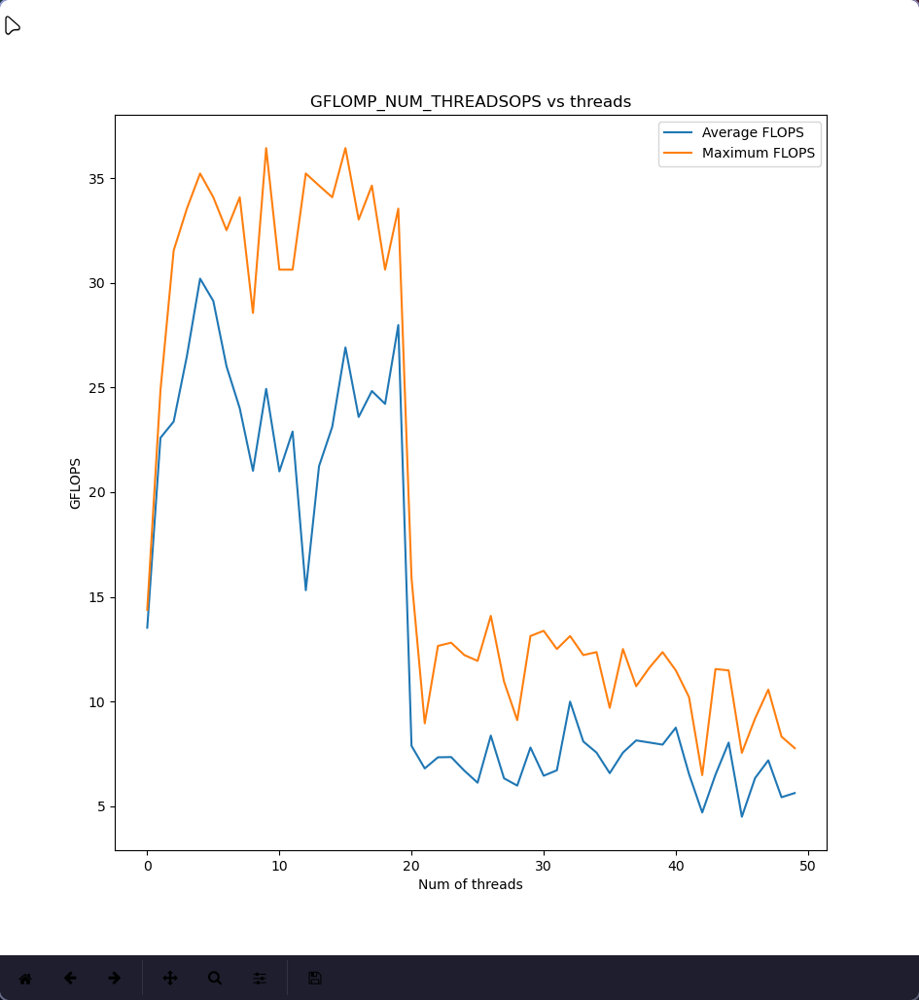

## System Information
### lscpu

```Architecture:                       x86_64
CPU op-mode(s):                     32-bit, 64-bit
Address sizes:                      39 bits physical, 48 bits virtual
Byte Order:                         Little Endian
CPU(s):                             20
On-line CPU(s) list:                0-19
Vendor ID:                          GenuineIntel
Model name:                         12th Gen Intel(R) Core(TM) i7-12700H
CPU family:                         6
Model:                              154
Thread(s) per core:                 2
Core(s) per socket:                 14
Socket(s):                          1
Stepping:                           3
CPU(s) scaling MHz:                 48%
CPU max MHz:                        4700.0000
CPU min MHz:                        400.0000
BogoMIPS:                           5378.00
Flags:                              fpu vme de pse tsc msr pae mce cx8 apic sep mtrr pge mca cmov pat pse36 clflush dts acpi mmx fxsr sse sse2 ss ht tm pbe syscall nx pdpe1gb rdtscp lm constant_tsc art arch_perfmon pebs bts rep_good nopl xtopology nonstop_tsc cpuid aperfmperf tsc_known_freq pni pclmulqdq dtes64 monitor ds_cpl vmx smx est tm2 ssse3 sdbg fma cx16 xtpr pdcm sse4_1 sse4_2 x2apic movbe popcnt tsc_deadline_timer aes xsave avx f16c rdrand lahf_lm abm 3dnowprefetch cpuid_fault epb ssbd ibrs ibpb stibp ibrs_enhanced tpr_shadow flexpriority ept vpid ept_ad fsgsbase tsc_adjust bmi1 avx2 smep bmi2 erms invpcid rdseed adx smap clflushopt clwb intel_pt sha_ni xsaveopt xsavec xgetbv1 xsaves split_lock_detect user_shstk avx_vnni dtherm ida arat pln pts hwp hwp_notify hwp_act_window hwp_epp hwp_pkg_req hfi vnmi umip pku ospke waitpkg gfni vaes vpclmulqdq rdpid movdiri movdir64b fsrm md_clear serialize arch_lbr ibt flush_l1d arch_capabilities
Virtualization:                     VT-x
L1d cache:                          544 KiB (14 instances)
L1i cache:                          704 KiB (14 instances)
L2 cache:                           11.5 MiB (8 instances)
L3 cache:                           24 MiB (1 instance)
NUMA node(s):                       1
NUMA node0 CPU(s):                  0-19
Vulnerability Gather data sampling: Not affected
Vulnerability Itlb multihit:        Not affected
Vulnerability L1tf:                 Not affected
Vulnerability Mds:                  Not affected
Vulnerability Meltdown:             Not affected
Vulnerability Mmio stale data:      Not affected
Vulnerability Retbleed:             Not affected
Vulnerability Spec rstack overflow: Not affected
Vulnerability Spec store bypass:    Mitigation; Speculative Store Bypass disabled via prctl
Vulnerability Spectre v1:           Mitigation; usercopy/swapgs barriers and __user pointer sanitization
Vulnerability Spectre v2:           Mitigation; Enhanced / Automatic IBRS, IBPB conditional, RSB filling, PBRSB-eIBRS SW sequence
Vulnerability Srbds:                Not affected
Vulnerability Tsx async abort:      Not affected
```

## Observations
Optimisation | Min Time (ms) | Avg. Time (ms) | Max Time (ms) | Min GLOPs | Avg GFLOPs | Max GFLOPs | Speedup Avg. (Max)
---|---|---|---|---|---|---|---
O0 | 1.849ms | 2.01976ms | 2.219ms | 0.952487 | 1.049435 | 1.143087 | x1.0 (x1.0)
O1 | 0.519ms | 0.63304ms | 0.771ms | 2.741333 | 3.377003 | 4.072385 | x3.22 (x3.56)
O2 | 0.511ms | 0.64296ms | 1.003ms | 2.107246 | 3.338444 | 4.136141 | x3.18 (x3.62)
O3 | 0.535ms | 0.67028ms | 0.967ms | 2.185696 | 3.223062 | 3.950594 | x3.07 (x3.46)
Vec | 0.285ms | 0.37172ms | 0.471ms | 4.487406 | 5.779853 | 7.416028 | x5.51 (x6.49)
Omp | 0.193ms | 0.26068ms | 0.401ms | 5.270743 | 8.41994 | 10.95113 | x8.02 (x9.58)
OmpVec | 0.127ms | 0.24704ms | 1.472ms | 1.435848 | 11.031497 | 16.642268 | x10.51 (x14.56)
SIMD | 0.134ms | 0.15568ms | 0.286ms | 7.390098 | 13.891682 | 15.772896 | x13.24 (x13.8)
SIMD-Vec | 0.133ms | 0.14372ms | 0.177ms | 11.941062 | 14.752421 | 15.891489 | x14.06 (x13.9)
SIMD-Omp | 0.063ms | 0.08956ms | 0.176ms | 12.008909 | 26.133695 | 33.548698 | x24.9 (x29.35)
SIMD-OmpVec | 0.058ms | 0.09728ms | 0.211ms | 10.01691 | 25.174953 | 36.440828 | x23.99 (x31.88)


The max GFLOPs achieved: 36.440828 with SIMD-OmpVec optimisation.

The min time achieved: 0.058ms with SIMD-OmpVec optimisation.


## Conclusion
The best optimisation I could get is upto 36.44 GFLOPs (x32 speedup) with SIMD, OMP and other compiler flags

All the flags used can be found in the [Makefile](Makefile)


OMP performance was the best at 4 threads as can be observed in the figure below



The code was run with battery plugged in. Performance almost halved when running on battery

The code was run on a 20 core Intel i7 12th gen machine

